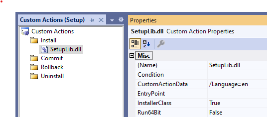

# Microsoft Setup

Creation of **MSI** package with localization for different languages. 
[Microsoft Visual Studio Installer Projects](https://marketplace.visualstudio.com/items?itemName=visualstudioclient.MicrosoftVisualStudio2017InstallerProjects)  plugin is used.

Solution contains 3 projects:
1) **BasicApplication** - console project to be installed.
2) **Setup** - Visual Studio Installer project.
3) **SetupLib** - Class library that defines **custom actions** for installer project and uses Windows Forms.

**Localization** using `.resx` files (determined by **Install** custom actions properties):
